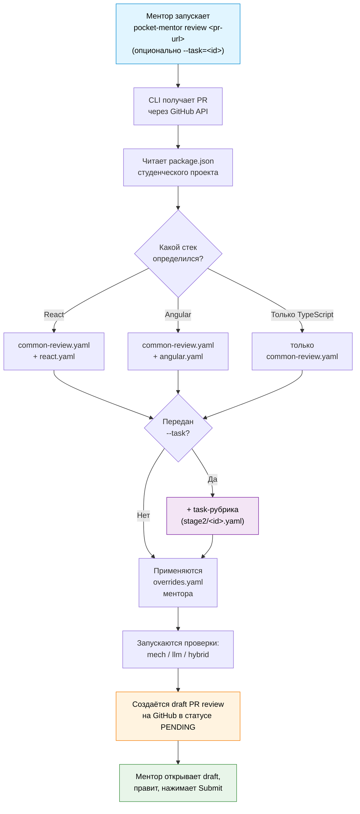

# Pocket Mentor — план разработки

> **Статус:** черновик плана, требует обсуждения.
> **Связанные документы:** [CONTEXT.md](./CONTEXT.md) (домен и термины), [SPEC.md](./SPEC.md) (детали имплементации).

---

## Краткое резюме

Pocket Mentor — это AI-ассистент для менторов, который генерирует **черновик ревью** по PR студента. Ментор открывает черновик в GitHub, правит и нажимает Submit.

Ключевая идея архитектуры: **четырёхслойная композиция рубрик**, где каждый слой имеет свой источник правды:

1. **Базовый слой** — общие требования к фронтенд-коду (всегда применяется)
2. **Стек-специфический слой** — детали под технологию (React / Angular / ...), подключается автоматически
3. **Слой задания** — рубрика конкретного task (RSS Puzzle, async-race, ...), подключается по флагу `--task` (для курсов с per-task оценкой, как Stage 2)
4. **Слой кастомизации ментора** — личные настройки (отключение критериев, добавление своих)

Все общие рубрики живут в отдельном репозитории `pocket-mentor-rubrics` — не зашиты в код приложения. Добавление поддержки нового стека = новый YAML-файл, не релиз приложения.

Источник критериев — **официальные документы RS School + curated материалы**, не выдумки. Это даёт легитимность и совместимость с тем, что менторы уже знают.

---

## 1. Что такое Pocket Mentor

**Это:** CLI для ментора. Ментор вводит ссылку на PR студента — получает на GitHub черновик ревью с inline-комментариями, предполагаемой оценкой и пояснениями в педагогическом тоне. Дальше ментор правит и публикует.

**Это НЕ:** замена ментору, общий code-reviewer, mock-interviewer.

**Принцип:** окончательное слово — за ментором. AI делает черновую работу.

---

## 2. Главная архитектурная идея — четыре слоя

### Зачем четыре слоя

Реальность ревью такова: некоторые критерии универсальны (PR оформление, чистый код, TypeScript usage), некоторые специфичны для стека (React hooks, Angular services), некоторые — специфичны для конкретного задания (на async-race нужна своя реализация Web Workers, на RSS Puzzle — свой drag-and-drop), а некоторые — личные предпочтения ментора.

Курсы тоже устроены по-разному:
- **React-курс** — плоская рубрика на все задания (mentor review 25 баллов).
- **Stage 2 frontend** — у каждого задания своя рубрика с конкретными баллами по пунктам и penalty правилами.

Четырёхслойная композиция покрывает оба паттерна: для React-курса слой задания просто не подключается (запускаем без `--task`), для Stage 2 — указываем `--task=<id>`.

### Структура слоёв

```
┌──────────────────────────────────────────────────────────────────┐
│  Слой 4: Личные настройки ментора                                │
│  ~/.pocket-mentor/overrides.yaml                                 │
│  • Отключить критерии                                            │
│  • Изменить веса                                                 │
│  • Добавить свои критерии                                        │
└──────────────────────────────────────────────────────────────────┘
                              ▲
┌──────────────────────────────────────────────────────────────────┐
│  Слой 3: Задание (по флагу --task)                               │
│  pocket-mentor-rubrics/stage2/async-race.yaml                    │
│  pocket-mentor-rubrics/stage2/rss-puzzle.yaml                    │
│  • Конкретные требования задания + точные баллы по пунктам       │
│  • Penalty правила (deadline miss, нет кросс-чека, ...)          │
│  • Подключается только когда передан --task                      │
└──────────────────────────────────────────────────────────────────┘
                              ▲
┌──────────────────────────────────────────────────────────────────┐
│  Слой 2: Специфика стека (auto-detect)                           │
│  pocket-mentor-rubrics/react.yaml                                │
│  pocket-mentor-rubrics/angular.yaml                              │
│  Подключается на основе содержимого package.json                 │
└──────────────────────────────────────────────────────────────────┘
                              ▲
┌──────────────────────────────────────────────────────────────────┐
│  Слой 1: Общие требования (всегда)                               │
│  pocket-mentor-rubrics/common-review.yaml                        │
│  PR formatting, TypeScript, clean code, KISS/DRY/SOLID           │
└──────────────────────────────────────────────────────────────────┘
```

При запуске ревью CLI комбинирует слои:

```
итоговая рубрика = common + (auto-detected stack) + (опционально task) + mentor overrides
```

Слой задания **полностью опционален**. Если флаг `--task` не передан — работаем по плоской рубрике (common + stack). Это сценарий React-курса.

### Как это работает в момент ревью



### Где живут рубрики

- **Слои 1, 2 и 3** — в публичном GitHub-репозитории `pocket-mentor-rubrics`. Один источник правды для всех менторов. Обновляется через PR-ы в этот репозиторий. Task-рубрики лежат в подпапке (например `stage2/async-race.yaml`).
- **Слой 4** — локальный файл `~/.pocket-mentor/overrides.yaml` на машине каждого ментора. Не делится ни с кем.

**Альтернатива для слоёв 1–3:** ментор или команда курса могут указать свой источник рубрик через флаг `--rubrics-source <git-url>` — это может быть форк официального репо или совсем отдельный репо с рубриками своей команды.

Это разделение даёт:
- **Стандартизацию** — все менторы стартуют с одной базы
- **Эволюцию** — обновление общих критериев = git pull
- **Свободу** — личные предпочтения каждого ментора не воздействуют на коллег

---

## 3. Источники правды для критериев

Это критичный момент: **мы не выдумываем критерии**. Берём из официальных документов и существующих curated материалов.

### Слой 1: `common-review.yaml`

| Источник | Какие критерии |
|---|---|
| `pull-request-review-process.md` (RS School) | PR оформление, репозиторий, коммиты, базовые проверки (линтер, сборка), шаги ревью |
| `clean-code/Clean-Code-Fundamental-Part1-6.md` (mentor-resources) | KISS, DRY, YAGNI, SRP, SOLID, читаемость, именование |
| `clean-code/TypeScript.md` | TypeScript best practices (применяется ко всем проектам — все на TS) |
| `clean-code/HTML.md`, `CSS.md`, `UI-UX.md` | HTML / CSS / UI-UX критерии |

### Слой 2: `react.yaml`

| Источник | Какие критерии |
|---|---|
| `react/modules/tasks/README.md` (RS School official) | No props drilling, no god components, no direct DOM (`appendChild`, `setAttribute`, `innerHTML`), tests pass + coverage shown |
| `clean-code/React.md` (mentor-resources) | Структура проекта и импорты, компоненты, оптимизация, формы, темы, антипаттерны |
| `templates/configs/eslint.react.config.js` | ESLint конфиг — эталон для проверки конфигурации в проекте студента |
| `templates/configs/tsconfig.react.json` | TS конфиг — эталон |

### Слой 2: `angular.yaml`

Источники определяются по аналогии (Angular-материалы по мере необходимости).

### Слой 3: task-рубрики (например `stage2/async-race.yaml`)

| Источник | Какие критерии |
|---|---|
| README конкретного задания (RS School / Stage 2) | Конкретные требования задания, точные баллы по пунктам, penalty правила |
| `clean-code/*` | Дополнительные референсы по теме задания (если применимо) |

Авторство — у того, кто хорошо знает требования конкретного задания. Workflow генерации YAML — отдельный раздел ниже.

### Слой 4: `~/.pocket-mentor/overrides.yaml`

Источник — личный опыт ментора. Никаких общих рекомендаций — каждый ментор сам решает.

---

## 4. Принцип "не дублируем линтер"

Это важный архитектурный принцип, который заметно влияет на скорость и стоимость ревью.

**Что делает линтер:** проверяет конкретные правила в коде (no-console, no-unused-vars, prefer-const, ...). Это **детерминированные** проверки — то, что машина делает точно и быстро.

**Что не может линтер:** оценить архитектуру компонента, понятность именования, целесообразность абстракции, педагогический совет студенту. Это требует **суждения**.

**Принцип Pocket Mentor:** мы проверяем, что у студента **правильно настроен линтер** (mech check) и что **линтер проходит** (mech check). Если оба пройдены — мы **не вызываем LLM** для тех проверок, которые линтер уже сделал.

LLM подключается только там, где он **уникально полезен** — суждение об архитектуре, читаемости, корректности абстракций, педагогический комментарий.

**Это даёт:**
- Низкую стоимость ревью (меньше LLM-токенов)
- Высокую скорость (детерминированные проверки в разы быстрее LLM)
- Достоверность (линтер не "галлюцинирует", в отличие от LLM)

```yaml
# Так — правильно:
criteria:
  linter-configured-correctly:
    method: mech
    checker_id: eslint-rule-configured
    checker_config:
      required_rules: [no-console, no-unused-vars, prefer-const, ...]

  linter-passes:
    method: mech
    checker_id: package-scripts-match
    checker_config:
      script: lint
      must_succeed: true

# Так — НЕ делаем (избыточно, дублирует линтер):
# no-console-log: method: mech ...
# no-unused-vars: method: mech ...
```

---

## 5. Как это выглядит для пользователей

В системе **две роли**.

### Роль 1: Ментор — пользователь CLI

**Что делает:** ревьюит PR-ы студентов.
**Что НЕ делает:** не правит общие рубрики, не пишет YAML с нуля.
**Что может делать опционально:** редактировать свой `overrides.yaml` — добавить или отключить критерии под себя.

**Установка (один раз):**

```bash
$ npm install -g pocket-mentor-cli
$ pocket-mentor init

  ? GitHub token? <вводит>
  ? Anthropic API key? <вводит>
  ✓ Клонированы общие рубрики (common-review, react, angular)
  ✓ Создан пустой overrides.yaml (можно править позже)
  ✓ Готово!
```

**Ежедневное использование (React-курс, плоская рубрика):**

```bash
$ pocket-mentor review https://github.com/student/repo/pull/42

  ✓ Получаю PR...
  ✓ Определён стек: React (по package.json: react, react-dom)
  ✓ Применяю рубрики:
      • common-review.yaml     (14 критериев)
      • react.yaml              (8 критериев)
      • overrides.yaml          (без изменений)
                                = 22 активных критерия
  ✓ Запускаю проверки (mech 12, llm 6, hybrid 4)...
  ✓ Черновик ревью создан: https://github.com/.../#pullrequestreview-...
```

**Stage 2 с task-рубрикой:**

```bash
$ pocket-mentor review https://github.com/student/repo/pull/42 --task=async-race

  ✓ Получаю PR...
  ✓ Определён стек: TypeScript (без UI-фреймворка)
  ✓ Применяю рубрики:
      • common-review.yaml          (14 критериев)
      • stage2/async-race.yaml       (12 критериев + 3 penalty правила)
      • overrides.yaml               (без изменений)
                                     = 26 активных критериев
  ✓ Запускаю проверки (mech 14, llm 8, hybrid 4)...
  ✓ Черновик ревью создан: https://github.com/.../#pullrequestreview-...
```

**Опциональная кастомизация:**

```bash
$ pocket-mentor overrides edit
# открывает ~/.pocket-mentor/overrides.yaml в редакторе

# Ментор пишет:
disable:
  - common-review:no-unnecessary-comments   # "у меня высокая планка по комментариям, не нужно"
  - react:tests-coverage-shown              # "не у всех студентов есть тесты"

additional_criteria:
  my-accessibility-check:
    title: "Семантические HTML-теги"
    points_max: 10
    method: llm
    llm_focus: "Используются ли <button>, <nav>, <main>, или везде <div>?"
```

### Роль 2: Автор рубрики

**Кто это:** любой ментор, который хочет добавить или поддерживать рубрику — для стека (React, Angular, Vue), для конкретного задания (Stage 2 task) или для своих личных нужд.

**Что делает:** пишет YAML-файл по шаблону и кладёт его туда, откуда его прочитает CLI. Вариантов размещения три:

1. **Официальный репо `pocket-mentor-rubrics`** — публичный, открыт для PR. Подходит для рубрик, полезных всем менторам курса. Maintainer репо мерджит PR-ы, поддерживает базовые рубрики.
2. **Свой форк или отдельный репо** — если команда курса хочет вести рубрики отдельно. CLI поддерживает указание любого источника через флаг `--rubrics-source <git-url>`.
3. **Локально на машине ментора** — для экспериментов или личных рубрик, которые нет смысла шарить.

**Сценарий — добавить новый стек или task-рубрику:**

```bash
# 1. Скопировать шаблон
$ cp _template.yaml vue.yaml
# отредактировать: добавить критерии и applies_when

# 2. Положить в нужное место:
#    - в свой форк pocket-mentor-rubrics → PR в основной репо
#    - в свой репо команды → менторы указывают через --rubrics-source
#    - локально → не шарится
```

**Снижение нагрузки на одного человека.** В стартовый набор v0.9 входят базовые рубрики (`common-review`, `react`, `async-race`), их пишет инициатор проекта. Дальше — модель открытого contribution: любой ментор может добавить свою рубрику через PR в публичный репо. Maintainer ревьюит, не пишет за всех.

---

## 6. Формат рубрики

### Общая структура файла

```yaml
rubric_id: react
title: "React-специфика"
description: "Применяется поверх common-review.yaml на React-проектах."

# Когда подключается этот слой (только для stack-рубрик)
applies_when:
  any_dependency: [react, react-dom]

# Критерии — каждый со всей информацией для проверки
criteria:
  no-direct-dom:
    title: "Нет прямой манипуляции DOM"
    points_max: 10
    text: |
      В React-приложении не должно быть прямых вызовов appendChild,
      setAttribute, innerHTML — это нарушает работу Virtual DOM.
    method: mech
    checker_id: forbidden-patterns
    checker_config:
      forbidden:
        - "\\.appendChild\\("
        - "\\.setAttribute\\("
        - "\\.innerHTML\\s*="
      exclude_paths: ["**/*.test.*"]
    reference: "https://github.com/HelgaZhizhka/mentor-resources/blob/master/clean-code/React.md"

  no-god-components:
    title: "Нет god-компонентов"
    points_max: 15
    text: |
      Компоненты не должны быть слишком большими и нести слишком много
      ответственностей. Признак god-компонента: > 300 строк, или
      смешивает UI + data fetching + бизнес-логику.
    method: hybrid
    checker_id: component-line-count
    checker_config:
      max_lines: 300
    llm_focus: |
      Если найдены компоненты больше 300 строк — оцени, действительно ли
      это god-компонент (нарушает SRP) или объёмный по необходимости.

  component-architecture:
    title: "Разумная архитектура компонентов"
    points_max: 20
    text: |
      Компоненты разбиты по ответственности, нет глубокого props drilling.
    method: llm
    llm_focus: |
      Оцени структуру src/components/. Обращай внимание на:
      - Props drilling (передача props через 3+ уровней без нужды)
      - Смешение responsibilities (UI + data + side effects в одном компоненте)
      - Отсутствие выделения переиспользуемых частей
    reference: "https://dmitripavlutin.com/7-architectural-attributes-of-a-reliable-react-component/"
```

### Свойства формата

- Один файл — всё видно сразу
- Понятен ментору-человеку без чтения кода
- Под git, ревьюется через PR, версионируется
- Ссылки на reference материал — для педагогического контекста
- `applies_when` — условие подключения слоя (для stack-рубрик)
- `method: mech / llm / hybrid` — где какой механизм используется

### Task-рубрика — penalty и точные баллы

Для Stage 2 формат тот же, плюс блок `penalty` и точные `points_max` по каждому пункту согласно README задания:

```yaml
rubric_id: stage2/async-race
title: "Async Race — Stage 2"
description: "Применяется поверх common-review.yaml для задания async-race."

# Penalty правила курса
penalty:
  deadline-miss:
    title: "Сдано после дедлайна"
    points_delta: -25
    method: mech
    checker_id: pr-merge-date-after
    checker_config:
      deadline_field: "course.deadline"

  no-cross-check:
    title: "Не выполнен кросс-чек"
    points_delta: -15
    method: llm
    llm_focus: "Был ли кросс-чек по правилам курса?"

criteria:
  garage-page-create:
    title: "Создание машины (одна и несколько)"
    points_max: 10
    text: |
      Должны работать создание одной машины (форма + кнопка "Create")
      и создание 100 случайных машин (кнопка "Generate cars").
    method: hybrid
    ...

  race-engine-correct:
    title: "Корректная работа гонки"
    points_max: 20
    ...
```

---

## 7. Калибровка под уровень студента

Это важный продуктовый аспект, не архитектурный, но влияет на саму идею ценности.

### Проблема

Хорошо настроенная рубрика + строгие mech-проверки находят **больше** нарушений, чем человек-ментор заметил бы за 30 минут ревью. Это техническое преимущество, но если просто вывалить 40 комментариев на работу новичка — студент демотивируется, закрывает PR, не дорабатывает. Цель ревью — научить, а не наказать.

LLM хорошо **находят** нарушения, но плохо **триажируют**: они не отличают "критично" от "придирка" в контексте уровня студента. Поэтому триаж встраивается в pipeline явно, в несколько слоёв.

### Механизмы калибровки

| Уровень | Что делает | Кто настраивает |
|---|---|---|
| **`severity` у каждого критерия** (`error` / `warning` / `info`) | Метаданные критерия — насколько он критичен в принципе | Автор рубрики |
| **CLI-флаг `--level`** (`junior` / `standard` / `senior`) | Фильтрует по severity + меняет тон LLM-комментариев | Ментор, под конкретного студента |
| **Caps на количество комментариев** (`max_per_criterion`, `max_per_file`, `max_total`) | Если найдено 30 одинаковых нарушений — показать 3 + summary "и ещё 27 похожих" | Автор рубрики (defaults в `common-review.yaml`) |
| **Структурный шаблон комментария** в LLM-промпте | "Что не так → почему важно → один пример было/стало. Максимум 3 предложения. Без жаргона." | Жёстко в коде LLM-orchestrator |
| **Summary-first body** | В заголовке draft review — 3 главные вещи, потом детальные комментарии | Автоматически после агрегации |

### Уровни `--level` — что меняется

- **`junior`** (default) — только `error` + топ-3 `warning`. Тон LLM: мягкий, объясняющий *почему*, обязательно пример, "это типичная ошибка, не страшно".
- **`standard`** — `error` + `warning`. Тон нейтральный, краткий.
- **`senior`** — всё, включая `info`. Тон сухой, expert-to-expert, без избыточных пояснений.

Ментор выбирает по контексту: первая неделя — `junior`, финальный проект — `standard` или `senior`.

### Ссылки и примеры

- **Пример внутри комментария важнее ссылки** — студенты часто не кликают. Шаблон комментария обязательно содержит 3-строчный пример "было/стало".
- **Ссылки только на курируемые материалы** (`clean-code/*`, RS School docs) и **только через поле `reference:` в YAML** — автор рубрики прописал, не LLM придумал на лету. Это защита от галлюцинаций URL.

### Что это значит для архитектуры

- В combined YAML — поле `severity` у каждого критерия (тип `ViolationSeverity` уже есть в коде, не используется для фильтрации).
- В формат YAML — опциональный блок `review_limits` (глобально в `common-review.yaml`).
- В CLI — флаг `--level=junior|standard|senior`, default `junior`.
- В LLM-orchestrator — структурный шаблон комментария + summary-генератор.

Полная спецификация (точные промпты, mapping severity → level, формулы caps) — детали имплементации M4c. На уровне утверждения плана — фиксируем подход.

---

## 8. Авто-детект стека

CLI определяет стек по содержимому `package.json` студенческого репозитория:

```typescript
// Псевдокод детектора
const stack = detect(packageJson);
// → читает dependencies + devDependencies
// → проверяет applies_when каждой stack-рубрики
// → возвращает список подходящих рубрик

// Примеры:
// { react, react-dom } → [react.yaml]
// { @angular/core } → [angular.yaml]
// { только typescript } → [] (стек не определён, применяется только common)
```

**Что если стек не определён?** Применяется только `common-review.yaml`. Это корректное поведение для проектов на чистом TypeScript без UI-фреймворка (как, например, async-race).

**Что если определилось несколько стеков?** Применяются все. Редкий, но возможный случай для гибридных приложений.

---

## 9. Дорожная карта

### Что уже сделано

- Базовая инфраструктура: pnpm workspace, TypeScript strict, ESM, Node ≥20
- **Восемь generic механических чекеров** с параметризацией (registry pattern)
- Принцип "не дублируем линтер" — зафиксирован архитектурно

### Что нужно сделать

| Этап | Содержание |
|---|---|
| **Загрузчик рубрик под новый формат** | Combined YAML (критерии + конфиг проверок в одном файле), новый источник (`pocket-mentor-rubrics`), обновление Zod-схемы. |
| **Расширение чекеров** | Дополнительные чекеры под React-специфику (forbidden-patterns, component-line-count) и общие правила (eslint-rule-configured расширения) |
| **LLM-проверки** | Интеграция с LLM API, обработка критериев с `method: llm`, объединение в hybrid |
| **Композиция рубрик** | Слой 1 + Слой 2 (auto-detect) + Слой 3 (overrides). Загрузчик, мерджер, валидация конфликтов |
| **CLI + GitHub draft reviews** | Команды `init`, `review`, `rubrics list/sync`, `overrides edit`. Создание draft review через GitHub API. |
| **Публичный репо рубрик + стартовый набор** | Создать публичный `pocket-mentor-rubrics`. Реализовать `common-review.yaml`, `react.yaml`, `stage2/async-race.yaml` (как первая task-рубрика, наш изначальный use-case). Добавить `_template.yaml` + `CONTRIBUTING.md` для будущих авторов. `angular.yaml` — по мере появления Angular-курса в скоупе. |
| **Композиция task-слоя** | Загрузчик `stage2/<task>.yaml` по флагу `--task`. Слияние с базой. Обработка `penalty` блока. |
| **Поддержка альтернативных источников рубрик** | CLI-флаг `--rubrics-source <git-url>` для указания произвольного репо рубрик (форк или отдельный). Минимальная децентрализация — без сложной инфраструктуры, по мере появления интереса от других менторов. |
| **Калибровка на действующих курсах** | Прогон на исторических PR-ах. Оценка качества — что AI удержал, что отбросил ментор. Корректировка критериев и текстов комментариев. |

---

## 10. Что ещё нужно уточнить

1. **Список React-чекеров** — у нас есть концептуальные критерии из RS School React README, нужно решить, какие реализовать как `mech` (детектируются), какие как `llm` (требуют суждения), какие как `hybrid`.
2. **`angular.yaml`** — пока критерии и материалы для Angular менее формализованы. Соберём перед реализацией.
3. **Конфликт-резолюция при override** — если ментор отключает критерий, который часть hybrid-связки, что происходит? Решим спецификацией.
4. **Интеграция с TANDI** (новая система управления курсами) — в текущей версии не интегрируемся, работаем автономно. Если потребуется другой формат — обсудим отдельно.

---

## 11. Риски и митигация

| Риск | Митигация |
|---|---|
| Одна common-рубрика "не лезет" на нестандартный проект | Stack-рубрики + override-механизм решают это by design. Common покрывает только то, что реально универсально. |
| Авто-детект стека ошибается (монорепо, гибрид) | Можно указать стек вручную: `--stack=react`. Fallback на `common-only`. |
| Override от ментора ломает hybrid-связку | Валидация при загрузке overrides. Понятная ошибка с подсказкой. |
| Менторы не хотят ставить CLI | `npx pocket-mentor-cli` без install. `init` — 2 минуты. |
| Все YAML на одном человеке (bottleneck) | Репо публичный с первого дня, есть `_template.yaml` и `CONTRIBUTING.md`. Любой ментор может добавить рубрику через PR. Альтернативно — указать свой источник через `--rubrics-source`. Расширенные команды (генерация из README, multi-source) — по мере реального запроса. |
| Слишком объёмное ревью демотивирует студента | Калибровка в несколько слоёв (см. §7): `severity` у критериев, флаг `--level=junior\|standard\|senior` у CLI, caps на количество комментариев, структурный шаблон с обязательным примером и максимум 3 предложениями, summary-first в теле ревью. |
| Изменение требований курса | Common-рубрика основана на общих принципах, не на конкретном задании — мало подвержена изменениям курса. Stack-рубрики обновляются через PR в репо рубрик. |
| Школьный документ (`pull-request-review-process.md`) обновляется | Команда `pocket-mentor rubrics check-sync` показывает дрейф. Обновление common-review.yaml — ручное, когда нужно. |

---

## 12. Что прошу подтвердить

1. **Четырёхслойная архитектура рубрик** — base + stack + task (опционально) + mentor overrides. Покрывает курсы с плоской рубрикой (React) и курсы с per-task оценкой (Stage 2) в одной модели.
2. **Целевая аудитория** — менторы, ревьюящие PR-ы студентов на действующих курсах.
3. **Источники правды** — официальный RS School PR review process doc + наши clean-code материалы + RS School React tasks README + README отдельных Stage 2 заданий. Не выдумываем критерии.
4. **Принцип "не дублируем линтер"** — LLM подключается только там, где он уникально полезен.
5. **Автономность от TANDI** — Pocket Mentor работает независимо. Интеграция — отдельный разговор, если потребуется.
6. **Открытая модель авторства рубрик** — публичный репо `pocket-mentor-rubrics` с первого дня, любой ментор может contributить через PR. Альтернативно — свой источник через флаг `--rubrics-source`. На старте базовые рубрики делает инициатор, дальше — open contribution. Без построения сложной инфраструктуры до появления реального интереса.
7. **Калибровка вывода под уровень студента** — `severity` у критериев + `--level` у CLI (`junior` default) + caps на количество комментариев + структурный шаблон с обязательным примером + summary-first. Цель: ревью должно учить, а не вываливать 40 проблем разом.

